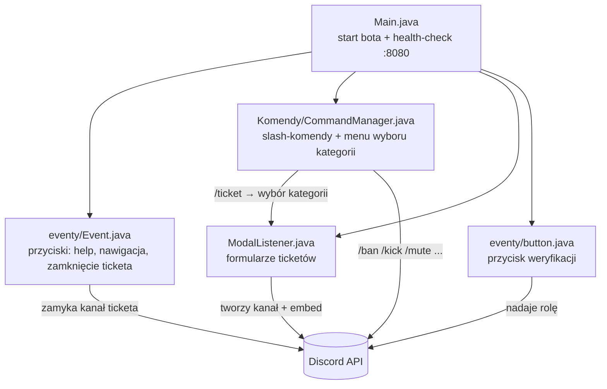

# DERP_HC_BOT

> ⚠️ **Projekt nieaktualny.** Kod pochodzi z 2023 roku i jest udostępniony wyłącznie jako archiwum/przykład — serwer, dla którego bot powstał, już nie istnieje, część zależności (JDA 5.0.0-beta.5) jest przestarzała, a niektóre identyfikatory (role, kategorie kanałów) są zaszyte na sztywno w kodzie pod konkretny, nieistniejący już serwer Discord. **Nie zalecane do użycia produkcyjnego** bez gruntownego odświeżenia.

Bot Discord napisany w Javie (JDA 5), stworzony na potrzeby serwera **FlurryMC.pl** (serwer już nie istnieje). Obsługiwał system ticketów pomocy, weryfikację nowych członków, podstawową moderację oraz kilka komend rozrywkowych.

To był mój pierwszy poważny projekt — w tamtym czasie dopiero uczyłem się programować, więc jakość kodu jest tym, czym jest. Repo trzymam jako pamiątkę i punkt odniesienia do tego, jak wyglądały moje początki.

## Funkcje

- **System ticketów** (`/ticket`) — menu wyboru kategorii (brak rangi, skarga, problem na serwerze, odwołanie od kary, zapomniane dane logowania, rekrutacja na testera, inne), po wyborze otwierał się formularz (modal), a bot tworzył prywatny kanał tekstowy z opisem zgłoszenia i przyciskiem do zamknięcia ticketa.
- **Weryfikacja** (`/weryfikacja`) — wysyłała wiadomość z przyciskiem, po kliknięciu którego użytkownik dostawał rolę zweryfikowanego członka.
- **Moderacja** — `/ban`, `/unban`, `/kick`, `/mute`, `/unmute`.
- **Pozostałe** — `/hello`, `/ping`, `/meme` (losowy mem z meme-api.com), `/help` (lista komend z nawigacją na przyciskach).
- Wbudowany, minimalny serwer HTTP (port `8080`) zwracający `200 OK`, przydatny jako health-check przy hostingu (np. Railway/Render/Replit).

## Architektura



## Wymagania

- Java 18+
- Maven
- Token bota Discord (Discord Developer Portal) z włączonymi *Privileged Gateway Intents*: `Server Members`, `Presence`.

## Konfiguracja

1. Skopiuj `.env.example` do `.env`:
   ```bash
   cp .env.example .env
   ```
2. Uzupełnij token bota w `.env`:
   ```
   TOKEN=twoj_token_bota
   ```

Część identyfikatorów (role, kategorie kanałów) jest zaszyta na sztywno w kodzie (`ModalListener.java`, `eventy/Event.java`, `eventy/button.java`) i odnosiła się do konkretnego serwera Discord — przy uruchamianiu na innym serwerze trzeba je podmienić na własne ID ról/kategorii.

## Uruchomienie

```bash
mvn clean package
java -jar target/DERP_HC_BOT-1.0-SNAPSHOT.jar
```

Po starcie bot rejestruje komendy slash globalnie (propagacja może zająć do godziny) i wystawia health-check pod `http://localhost:8080`.

## Stos technologiczny

- [JDA](https://github.com/discord-jda/JDA) — biblioteka do komunikacji z Discord API
- [dotenv-java](https://github.com/cdimascio/dotenv-java) — wczytywanie zmiennych z `.env`
- `org.json` — parsowanie odpowiedzi API mema

## Licencja

[MIT](LICENSE)
